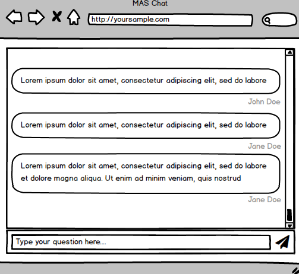

   # **MAS Q&A - Take Home Code Challenge** #





This sample project is designed to assess your front-end development capabilities.

The goal of this project is to build a simple “question submission” module that allows event attendees to submit questions to a presenter and view questions submitted by other attendees.


# **Requirements** #


* The module should be a responsive HTML document. 

* The overall layout should match the wireframe provided at the top of this document but you may use your discretion as to the exact styling. You will not be specifically evaluated on the basis of styling choices though we encourage you to show good design taste.

* How you structure/implement this project is largely up to you and you may use any libraries and/or frameworks that you choose include React, Vue, and Angular.

* We are providing a purpose-built API for this project that you will use to GET questions and POST new questions.  On load, the module should do a GET request to the api to load a list of existing questions

* You can assume that other questions will be added from outside sources while your widget is being reviewed. Therefore you should devise some way of keeping your widget in sync with the data on the API and balance the need for responsiveness without making excessive network requests.

* This is a front end challenge, so any new messages that are added should t appear with a smooth transition effect.

* You can assume that the widget is being passed the askers first name and last name as a pair of url query parameters.

     * An example url  with query parameters might look like: ```http://www.our-widget.com?firstName=Jane&lastName=Doe```


# **Api Documentation** #

## Quick Start ##

We’ve created a simple TOY api for you to play with. It’s located here:

```https://question-toy-server.herokuapp.com/api/questions```


You can test it by running the following command in a terminal with  ```curl```

```bash
$ curl https://question-toy-server.herokuapp.com/api/questions
{"questions":[{"_id":"5fcd7dd73accac6788e502e3","firstName":"Matthew","lastName":"Haber","content":"What is your favorite color?","timestamp":"2020-12-07T00:56:55.416Z","__v":0},{"_id":"5fcd7df0ba60f767df49a340","firstName":"Matthew","lastName":"Haber","content":"What is your favorite color?","timestamp":"2020-12-07T00:57:20.152Z","__v":0},{"_id":"5fcd7e7dfcd192685dd846a6","firstName":"Malcom","lastName":"Jenkins","content":"Do you have any pets","timestamp":"2020-12-07T00:59:41.004Z","__v":0},{"_id":"5fcd907cf64d9b92fbef5d8a","firstName":"Stefanie","lastName":"Graf","content":"How are the winters in LA?","timestamp":"2020-12-07T02:16:28.920Z","__v":0},{"_id":"5fcd9167ae16c300171072a9","firstName":"Caroline","lastName":"Wozniacki","content":"Can you expand on that last point you made?","timestamp":"2020-12-07T02:20:23.592Z","__v":0}]}
```

or for a slightly prettier version:

```bash
$ curl https://question-toy-server.herokuapp.com/api/questions | jq
  % Total    % Received % Xferd  Average Speed   Time    Time     Time  Current
                                 Dload  Upload   Total   Spent    Left  Speed
100   846  100   846    0     0   6042      0 --:--:-- --:--:-- --:--:--  6042
{
  "questions": [
    {
      "_id": "5fcd7dd73accac6788e502e3",
      "firstName": "Matthew",
      "lastName": "Haber",
      "content": "What is your favorite color?",
      "timestamp": "2020-12-07T00:56:55.416Z",
      "__v": 0
    },
    {
      "_id": "5fcd7df0ba60f767df49a340",
      "firstName": "Matthew",
      "lastName": "Haber",
      "content": "What is your favorite color?",
      "timestamp": "2020-12-07T00:57:20.152Z",
      "__v": 0
    },
    {
      "_id": "5fcd7e7dfcd192685dd846a6",
      "firstName": "Malcom",
      "lastName": "Jenkins",
      "content": "Do you have any pets",
      "timestamp": "2020-12-07T00:59:41.004Z",
      "__v": 0
    },
    {
      "_id": "5fcd907cf64d9b92fbef5d8a",
      "firstName": "Stefanie",
      "lastName": "Graf",
      "content": "How are the winters in LA?",
      "timestamp": "2020-12-07T02:16:28.920Z",
      "__v": 0
    },
    {
      "_id": "5fcd9167ae16c300171072a9",
      "firstName": "Caroline",
      "lastName": "Wozniacki",
      "content": "Can you expand on that last point you made?",
      "timestamp": "2020-12-07T02:20:23.592Z",
      "__v": 0
    }
  ]
}
```


## Api Endpoints ##
The Api exposes two endpoints. They are:

## GET /api/questions. ##

* This will return a list of questions. 

## POST /api/questions. ##
* This will create a new question record. Required parameters are :
  * **firstName** : **String**
    * The asker's first name
  * **lastname** : **String**
    * The asker's last name
  * **content** : **String**
    * The content of the question

## Posting A Record ##
The Api will consume a json object in the body of the request. A simple HTTP request to the API might look like:

```http
POST /api/questions HTTP/1.1
Host: question-toy-server.herokuapp.com
Content-Type: application/json
Content-Length: 116

{
	"firstName" : "Caroline",
	"lastName" : "Wozniacki",
	"content" : "Can you expand on that last point you made?"
}
```

More information can be found in the yaml here : [api_spec.yaml](../blob/master/api_spec_yaml)


Good luck and happy coding!
  

# **Additional Notes** # 
* Provide the solution as a private Github or Bitbucket project, and share with matthew@moremas.com
* It is important to continually commit code with meaningful messages and context to demonstrate your ability to collaborate with other engineers
* The demo repo should be able to run locally on a QA engineer’s or supervisors laptop . A simple single page application is fine. Provide instructions in the readme detailing how to setup and run your application .
* We are reviewing code quality, organization, UI/UX, and the functionality of the application
* Do not worry about deployment or where this application would sit in a more complicated infrastructure
* Do not worry about the quality or the lack of security of the sample API. It exists solely to support this project
* Please either implement testing as part of your project or be prepared to discuss how you would approach testing for a project of this nature.


  


